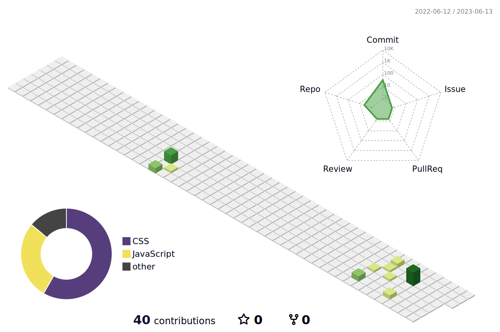

### Hi there 👋 
### This is Bingyang Xu

Welcome to my Github page! I am an EE master, non-professional and self-taught coder.
IT and CT technology Enthusiast

#### 🌱 Things I am currently working on: 
- Taking a [coursera course about AI](https://www.coursera.org/learn/ai-for-everyone)
- Working on a eCommerce full-stack web application
- Working on an outdoor activities full-stack web application
- Explore on AI-related media oppotunity

#### :muscle: Things I am challenging myself with:
- Improving my performance at [impact.com](https://impact.com)
- Being a really good dad :smile:

#### :computer: Tech I use: 

 
 
 

 
 
 

 
 
 

 

 

